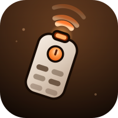

<div align="center">



# Broadlink IR/RF — Ulanzi Deck Plugin

**Turn any Deck key into a remote control.** Learn a code from your original remote, tap the key, the device obeys.

No Broadlink account. No cloud round-trip. Everything happens on your local network.

</div>

---

## What it does

Talks directly to a Broadlink RM over your LAN using the same local protocol Home Assistant uses. Point your original remote at the RM, press Learn, and the captured code is stored with that Deck button.

- **IR** — works on every RM model. Lights, TVs, air conditioners, fans, projectors.
- **RF 433/315MHz** — works on the RM Pro line. Blinds, garage doors, ceiling fans.
- **Local only** — no account, no internet dependency, ~10–30ms instead of a cloud round-trip.
- **Test button** — fire the code from the settings panel before you ever touch the physical key.

## Requirements

- A Broadlink RM device (RM4 Mini, RM4 Pro, RM3, RM Pro…) already on your Wi-Fi
- The **original physical remote** for whatever you want to control
- macOS 10.15+ or Windows 10+

> **Heads up:** the RM does not store codes. Your buttons in the Broadlink app live in Broadlink's cloud, and there is no local API to read them — the device only knows how to *learn* and *emit*. So you re-learn each code here once, from the physical remote. It takes about five seconds per button.

## Setup

1. Add a **Send Command** action to a key.
2. Hit **Scan**. Pick your device from the list.
3. Give the button a name (it shows on the key).
4. Press **Learn IR**, point the remote at the RM, press the button on the remote.
5. Press **Test** to confirm. Done.

### If Scan finds nothing

Broadcast discovery cannot cross a subnet — this is how IP works, not a bug. If your smart home lives on a separate IoT network, guest network, or VLAN, type the device's IP into the **"…or enter the IP directly"** field and press **Check**. A direct unicast hello reaches devices that broadcast never will.

Find the IP in your router's client list, or in the Broadlink app under the device's properties.

Worth doing either way: give the RM a **DHCP reservation** in your router. If its IP changes, the button stops working.

### Learning RF codes

RF capture is a two-stage handshake and each stage needs a different gesture:

1. Press **Learn RF** → **press and hold** the remote button while the RM sweeps for the frequency.
2. When it says the frequency is locked → **release, then tap** the same button a few times.

The panel tells you which one to do at each moment.

## Troubleshooting

**"…is locked to the cloud"** — the Broadlink app has locked the device to cloud-only control. Open the app, go to the device's properties, and turn **Lock device** off. No reset needed.

**Scan finds nothing but the device is definitely online** — see *If Scan finds nothing* above. Also confirm the device isn't on a guest network, which is isolated by design on most routers.

**Worked yesterday, dead today** — the RM's IP probably changed. Set a DHCP reservation.

## Development

```bash
make install    # bundle deps, install into Ulanzi Studio, restart it
make package    # build the distributable ZIP
make bump_patch # bump version in package.json + manifest.json
```

## Credits

Built on [`node-broadlink`](https://github.com/ThomasTavernier/broadlink-iot), a JavaScript port of [`python-broadlink`](https://github.com/mjg59/python-broadlink).

## License

MIT
